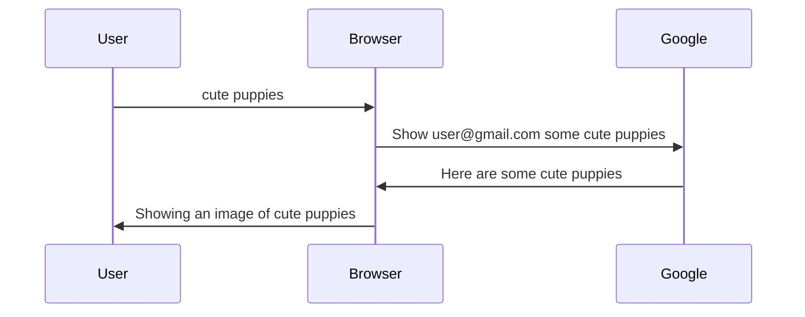

# A look at the Internet #

Have you ever wondered why the internet is important? Well, you've come to the right place! Today we're going to learn about the Internet 📶, so let's get started!

We can see the diagrams and I'll talk about them in detail!

First, let's make a diagram.

So, the user searched "cute puppies" and the browser has seen that, so it said to Google 
"Show a picture of some cute puppies." So google gave the browser a picture of cute puppies. Then the browser showed the cute puppies to the user.

But where does those cute puppies come from?

Which computer did those come from?

I'll give you some time.

............................................

..........................................

..........................................

...........................................

.........................................

Done!

If you have guessed Google's computer, than you are right! Every computer has some numbers. That is an IP address. This is just
like every house on the streets have a number.

The computer is called "google.com". The IP address is "172.217.14.228".